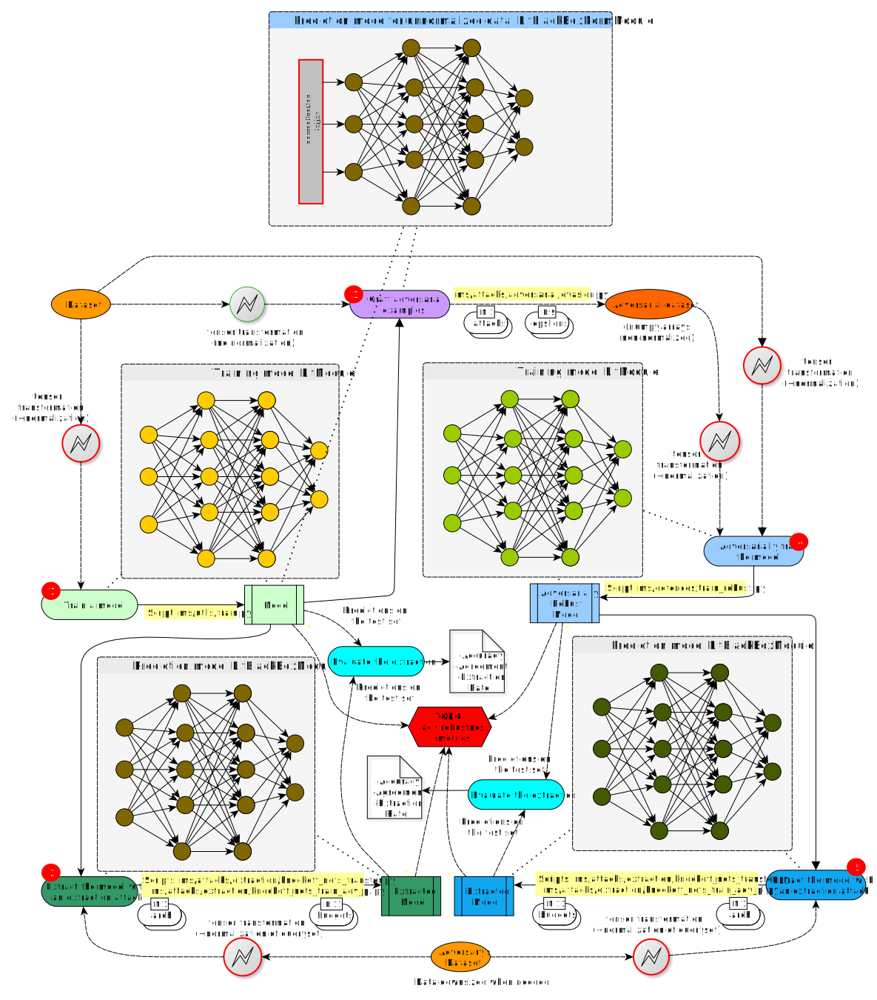

# Careful What You Wish For: on the Extraction of Adversarially Trained Models, PST 2022
Kacem Khaled, Gabriela Nicolescu and Felipe Gohring de Magalhães.

HESLab, Département de Génie Informatique et Génie Logiciel

Polytechnique Montréal, Montréal, Canada

------
### Abstract
Recent attacks on Machine Learning (ML) models such as evasion attacks with adversarial examples and models stealing through extraction attacks pose several security and privacy threats. Prior work proposes to use adversarial training to secure models from adversarial examples that can evade the classification of a model and deteriorate its performance. However, this protection technique affects the model's decision boundary and its prediction probabilities, hence it might raise model privacy risks. In fact, a malicious user using only a query access to the prediction output of a model can extract it and obtain a high-accuracy and high-fidelity surrogate model. To have a greater extraction, these attacks leverage the prediction probabilities of the victim model. Indeed, all previous work on extraction attacks do not take into consideration the changes in the training process for security purposes. In this paper, we propose a framework to assess extraction attacks on adversarially trained models with vision datasets. To the best of our knowledge, our work is the first to perform such evaluation. Through an extensive empirical study, we demonstrate that adversarially trained models are more vulnerable to extraction attacks than models obtained under natural training circumstances. They can achieve up to ×1.2 higher accuracy and agreement with a fraction lower than ×0.75 of the queries. We additionally find that the adversarial robustness capability is transferable through extraction attacks, i.e., extracted Deep Neural Networks (DNNs) from robust models show an enhanced accuracy to adversarial examples compared to extracted DNNs from naturally trained (i.e. standard) models.

------


TL,DR: A Framework for vulnerability assessment of model stealing attacks against adversarially trained Deep Learning models.


## Useful information for reproduction

### Environment setting:

Environment can be set:
- with `conda` using:
```bash
$ conda env create -f environment.yml
$ conda activate msf-env-conda
$ pip install -e .
```
to deactivate the environment use `conda deactivate`
- or, with `virtualenv` using:

```bash
$ virtualenv --no-download msf-env 
$ source msf-env/bin/activate   
$ pip install -r requirements.txt   
$ pip install -e .
```
to deactivate the environment use `deactivate`


## Framework flowchart with useful scripts



### To train a model (victim):
```
$ python ms/utils/train.py DS_NAME DIR [-a ARCH] [-o PATH] [-e N] [-b N] [--pretrained]
                [-s {step,onecycle,step_adam}]
                
positional arguments:
  DS_NAME               Dataset name
  DIR                   path to dataset

optional arguments:
  -a ARCH, --arch ARCH  model architecture: resnet34, vgg16, cnn, lenet ...
  -o PATH, --out_path PATH
                        Output path for model
  -e N, --epochs N      number of total epochs to run
  --lr LR, --learning-rate LR
                        initial learning rate (default: 0.05)
  -b N, --batch_size N  mini-batch size (default: 256)
  --pretrained          use pre-trained model
  -s {step,onecycle,step_adam}, --scheduler_choice {step,onecycle,step_adam}
                        Scheduler
more details about other arguments:
  -h, --help            show help message and exit
```


### Transfer Set construction:
```bash
$ python ms/attacks/extraction/knockoff_nets_transfer.py [-h] --out_dir PATH --budget N --queryset TYPE [--batch_size TYPE] [--root DIR]
                                 [--modelfamily TYPE] [-v VICTIM_SELECT] [-d D] [-w N]
                                 PATH
```
```
Construct transfer set

positional arguments:
  PATH                  Path to victim model. Should contain files "model_best.ckpt" and "params.json"

optional arguments:
  -h, --help            show this help message and exit
  --out_dir PATH        Destination directory to store transfer set
  --budget N            Size of transfer set to construct
  --queryset TYPE       Adversary's dataset (P_A(X))
  --batch_size TYPE     Batch size of queries
  --root DIR            Root directory for ImageFolder
  --modelfamily TYPE    Model family
  -v VICTIM_SELECT, --victim_select VICTIM_SELECT
                        Which victim, last: -1 or best: -2
  -d D, --device_id D   Device id
  -w N, --nworkers N    # Worker threads to load data
```


### Training Knock-offs
Pytorch lightning way using :
```bash
$ python ms/attacks/extraction/knockoff_nets_train_adv_pl.py [-h] [--budgets B] [--queryset TYPE] [-d D] [-b N] [-e N] [--lr LR]
                                     [--momentum M] [--log-interval N] [--resume PATH] [--lr_step N] [--lr_gamma N]
                                     [-w N] [--pretrained PRETRAINED] [--suffix SUFFIX] [--epsilon EPS]
                                     [--weighted-loss] [--argmaxed] [--optimizer_choice {sgd,sgdm,adam,adagrad}]
                                     [--scheduler_choice {step,onecycle,step_adam}]
                                     [--transferset_dir TRANSFERSET_DIR]
                                     DIR model_arch DS_NAME
```
```
Train a model

positional arguments:
  DIR                   Directory containing the output model and/ortransferset.pickle
  model_arch            Model name
  DS_NAME               Name of test

optional arguments:
  -h, --help            show this help message and exit
  --budgets B           Comma separated values of budgets. Knockoffs will be trained for each budget.
  --queryset TYPE       Name of transferset dataset
  -d D, --device_id D   Device id. -1 for CPU.
  -b N, --batch_size N  input batch size for training (default: 64)
  -e N, --epochs N      number of epochs to train (default: 100)
  --lr LR               learning rate (default: 0.05)
  --momentum M          SGD momentum (default: 0.5)
  --log-interval N      how many batches to wait before logging training status
  --resume PATH         path to latest checkpoint (default: none)
  --lr_step N           Step sizes for LR
  --lr_gamma N          LR Decay Rate
  -w N, --num_workers N
                        # Worker threads to load data
  --pretrained PRETRAINED
                        Use pretrained network
  --suffix SUFFIX       Add a suffix to modelname
  --epsilon EPS         Value of epsilons that will be used for extraction.
  --weighted-loss       Use a weighted loss
  --argmaxed            Only consider argmax labels
  --optimizer_choice {sgd,sgdm,adam,adagrad}
                        Optimizer
  --scheduler_choice {step,onecycle,step_adam}
                        Scheduler
  --transferset_dir TRANSFERSET_DIR
                        Directory containing transferset.pickle
```

### Testing the extraction attack:

```bash
$ python ms/utils/test.py [-h] [-a ADV_MODEL_DIR] [-v VICTIM_SELECT] [-f FILTER] [-n ADV_SELECT] [--root DIR] [--batch_size TYPE]
               [-d D] [-w N]
               PATH
```
```
Testing victim models models

positional arguments:
  PATH                  Path to victim model. Should contain files "model_best.ckpt" and "params.json"

optional arguments:
  -h, --help            show this help message and exit
  -a ADV_MODEL_DIR, --adv_model_dir ADV_MODEL_DIR
                        Path to adversary model. Should contain files "model_best.ckpt" and "params.json"
  -v VICTIM_SELECT, --victim_select VICTIM_SELECT
                        Which victim, last: -1 or best: -2
  -f FILTER, --filter FILTER
                        filter for victim and adv name choice
  -n ADV_SELECT, --adv_select ADV_SELECT
                        Nb of adversaries to show: last: -1 or all: -2
  --root DIR            Root directory for ImageFolder
  --batch_size TYPE     Batch size of queries
  -d D, --device_id D   Device id
  -w N, --nworkers N    # Worker threads to load data
```

### Adversarial Training
```bash
# attack a model using FGSM or PGD
$ python ms/attacks/adversarial/evasion.py [-h] [--out_dir PATH] [--batch_size TYPE] [--root DIR] [--modelfamily TYPE] [-v VICTIM_SELECT]
                  [--epsilons EPS] [-d D] [-w N]
                  PI PATH
```
```
Construct transfer set

positional arguments:
  PI                    Policy to use while training
  PATH                  Path to victim model. Should contain files "model_best.ckpt" and "params.json"

optional arguments:
  -h, --help            show this help message and exit
  --out_dir PATH        Destination directory to store adversarial set
  --batch_size TYPE     Batch size of queries
  --root DIR            Root directory for ImageFolder
  --modelfamily TYPE    Model family
  -v VICTIM_SELECT, --victim_select VICTIM_SELECT
                        Which victim, last: -1 or best: -2
  --epsilons EPS        Comma separated values of epsilons. Adversarial examples will be generated for each epsilon.
  -d D, --device_id D   Device id
  -w N, --nworkers N    # Worker threads to load data
```

### Scenario examples:

#### Cifar like datasets : CIFAR10, SVHN, CIFAR100
```bash
# Set the dataset name in the script ./scripts/cifar10_scenario.sh
$ chmod  +x  ./scripts/cifar10_scenario.sh
$ ./scripts/cifar10_scenario.sh > logs/logs-cifar10-extraction.out 2>&1 &
```

#### MNIST like datasets: MNIST, FashionMNIST, EMNIST...
```bash
# Set the dataset name in the script ./scripts/cubs200_scenario.sh
$ chmod  +x  ./scripts/mnist_scenario.sh
$ ./scripts/mnist_scenario.sh > logs/logs-mnist-extraction.out 2>&1 &
```

#### Large images datasets : CUBS200, Caltech256
```bash
# Set the dataset name in the script ./scripts/cubs200_scenario.sh
$ chmod  +x  ./scripts/cubs200_scenario.sh
$ ./scripts/cubs200_scenario.sh > logs/logs-cubs200-extraction.out 2>&1 &
```

## Logging Tool: Weights and Biases (WandB)
When launching a script for the first time you may be prompted to login to wandb account to visualize results, 
you may choose not to.
Currently all recent results are uploaded to a private account (https://wandb.ai/kacem/MSF).
You may change this with your account in the `config.py` file.

```bash
# To login before launching a script
$ wandb login
# Now paste your API Key
```


## Large files management: hardcoded dataset paths:
Config file with folders:
* `ms/config.py`

Paths to ImageNet dataset:
in `ms/datasets/imagenet1k.py` : 
- DATASET_ROOT: `root = osp.join(cfg.DATASET_ROOT, 'ILSVRC2012')`
- training_imgs: `super().__init__(root=osp.join(root, 'training_imgs'), transform=transform,
                         target_transform=target_transform)`

---
### Acknowledgement

Our code uses the state-of-the-art extraction attack KnockoffNets [1]. 
So, the attack part of our code is inspired by their github repository: https://github.com/tribhuvanesh/knockoffnets.
However, we did important changes to their attack code including: 
- a switch from Pytorch to Pytorch Lightning; 
- a support for multiple GPU training, and;
- experiment tracking and visualization with WandB [2].


[1] Orekondy, Tribhuvanesh, Bernt Schiele, and Mario Fritz. "Knockoff nets: Stealing functionality of black-box models." Proceedings of the IEEE/CVF Conference on Computer Vision and Pattern Recognition. 2019.

[2] L. Biewald, “Experiment Tracking with Weights and Biases,” Weights & Biases. [Online]. Available: http://wandb.com/. [Accessed: 2021/10/01].
Software available from wandb.com